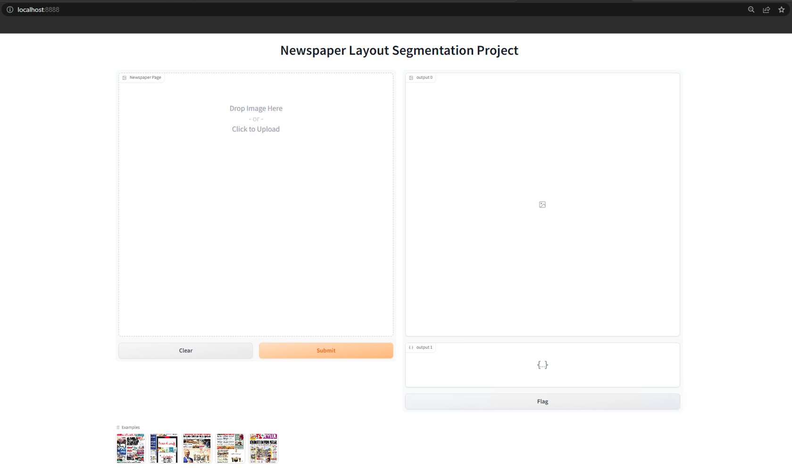
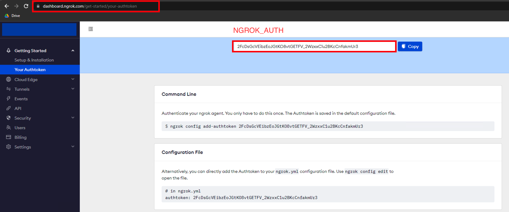

# Branch Structures
    1. main branch -> docker_compose - ngrok - gradio - detectron2
    
    2. docker-gradio-detectron2 branch -> dockerfile - gradio - detectron2 

<br> 

## First Build Docker Compose 

```
docker-compose build
```

## Run Docker Compose

```
docker-compose up
```
<br><br>

### Localhost View


### Result View

<br><br>


Sign up to Ngrok (https://ngrok.com/) to get time limitless endpoint 
take the NGROK_AUTH key and paste it in docker-compose.yaml
